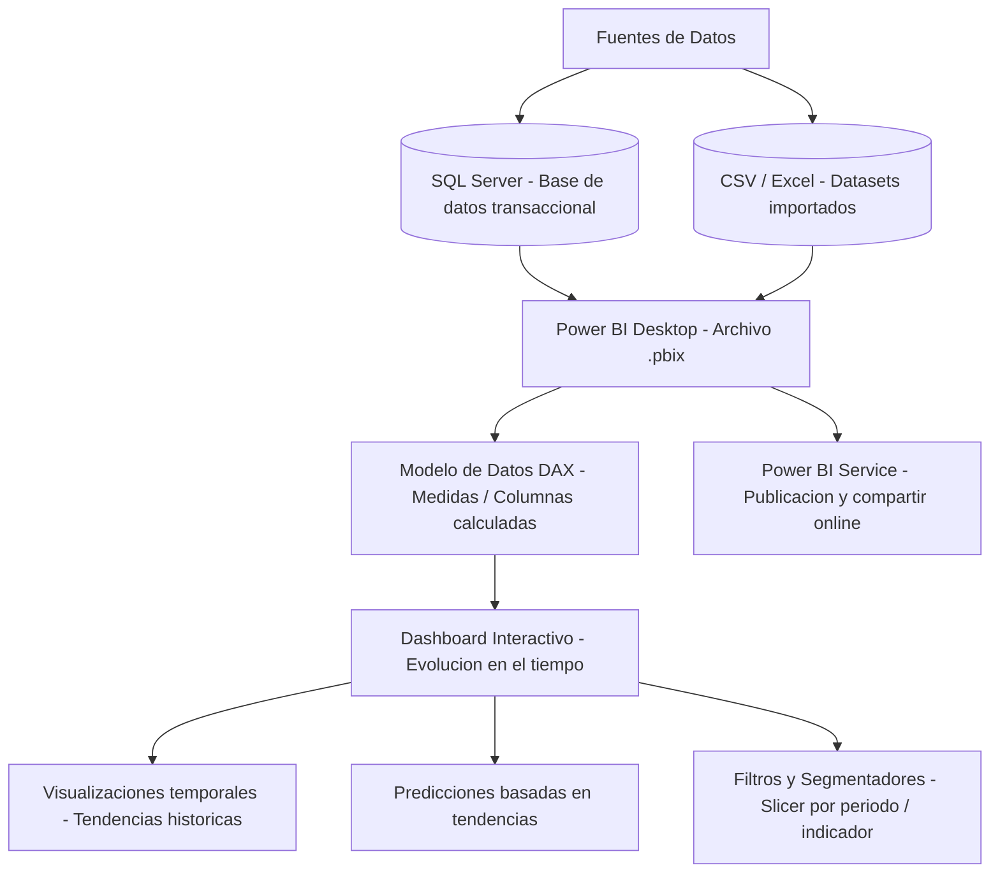

# 📌 Visualización Interactiva de Información - Evolución en el Tiempo (Power BI)  

## 📖 Descripción

---

Este proyecto utiliza Power BI para visualizar la evolución de diferentes indicadores a lo largo del tiempo, permitiendo la exploración de tendencias en múltiples sectores.

## 🛠️ Funcionalidades  
- Análisis temporal de datos en Power BI.  
- Creación de dashboards interactivos.  
- Predicciones basadas en tendencias históricas.  
- Exportación de reportes en formatos accesibles.  

## 🚀 Tecnologías utilizadas  
- Power BI  
- SQL Server  
- DAX (Data Analysis Expressions)  
- Business Intelligence  

## ▶️ Cómo ejecutar el proyecto  
1. Abrir el archivo `.pbix` en Power BI Desktop.  
2. Conectar la base de datos en SQL Server o importar datasets en CSV/Excel.  
3. Aplicar filtros y explorar visualizaciones dinámicas.  
4. Publicar en Power BI Service si se requiere compartir online.  

## 📌 Autor  
👨‍💻 **Alejandro De Mendoza**

---

## Arquitectura

## Autor

**Alejandro De Mendoza**  
Ingeniero Informático · Especialista en IA · Especialista en Ingeniería de Software · Máster en Arquitectura de Software

